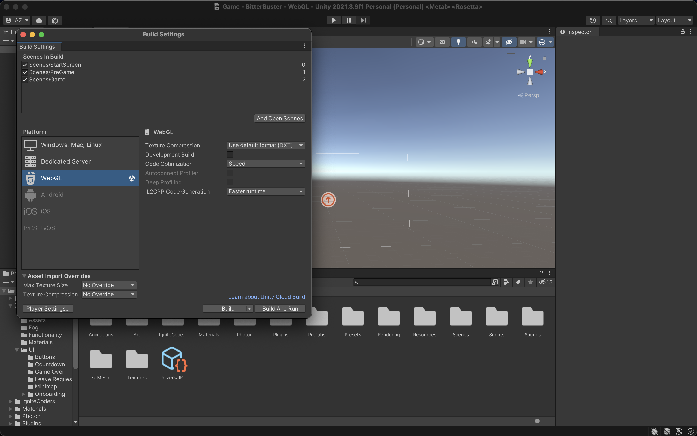

# BitterBuster Building
## Overview
This document provides the details on how to make a build for BitterBuster.

## Building
1. Click on `File -> Build Settings` to open the Build Settings window
2. Select the desired platform for building (WebGL, Windows, Linux, Mac). If development logging is needed, check the "Development Build" box
3. Click on "Build". This will open a window to select a folder to output the build, then start the build

### Hosting a Web Build
For testing, the HAI team used [itch.io](https://itch.io/) to host easily shareable web builds. Below are instructions on how to set up your own test builds.

1. Make a WebGL build in Unity and ZIP together all the files in the output build folder
2. Log in or register for an account on [itch.io](https://itch.io/)
3. Go to the [new project page](https://itch.io/game/new)
4. Fill in fields for project name, description, etc. For "Kind of project", select `HTML`
5. Under "Uploads", click on "Upload files" and select the zip file from step 1. You can also upload other builds (Windows, Linux) for easy sharing
6. You can alter the viewport dimensions, but as the game runs on 16:9 aspect ratio, we have often tested with 1280x720px
7. At the bottom of the page, you are able to set privacy restrictions on the build. Generally, we select "Restricted" and check the "Also allow a password to view page"
8. Once everything is set up, click on the "Save & view page" button at the bottom of the page
