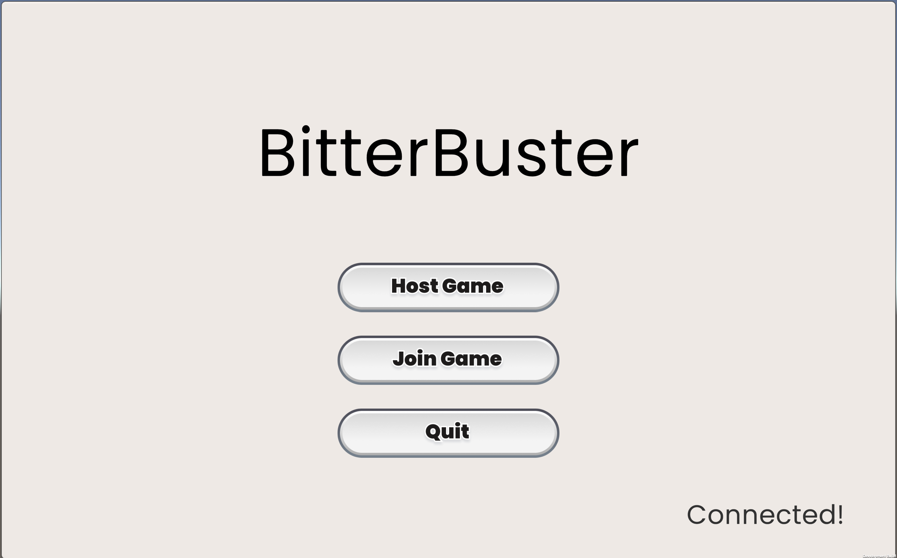
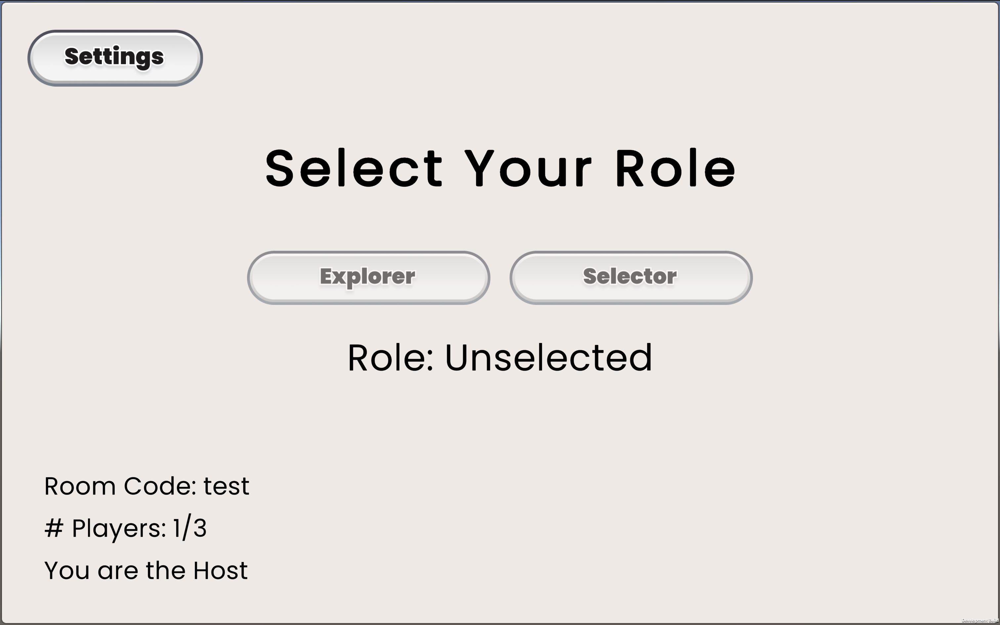
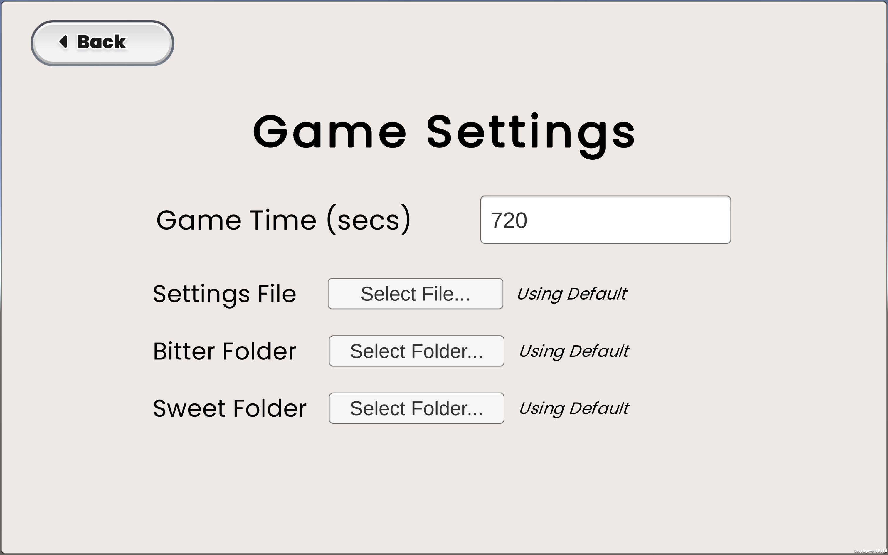
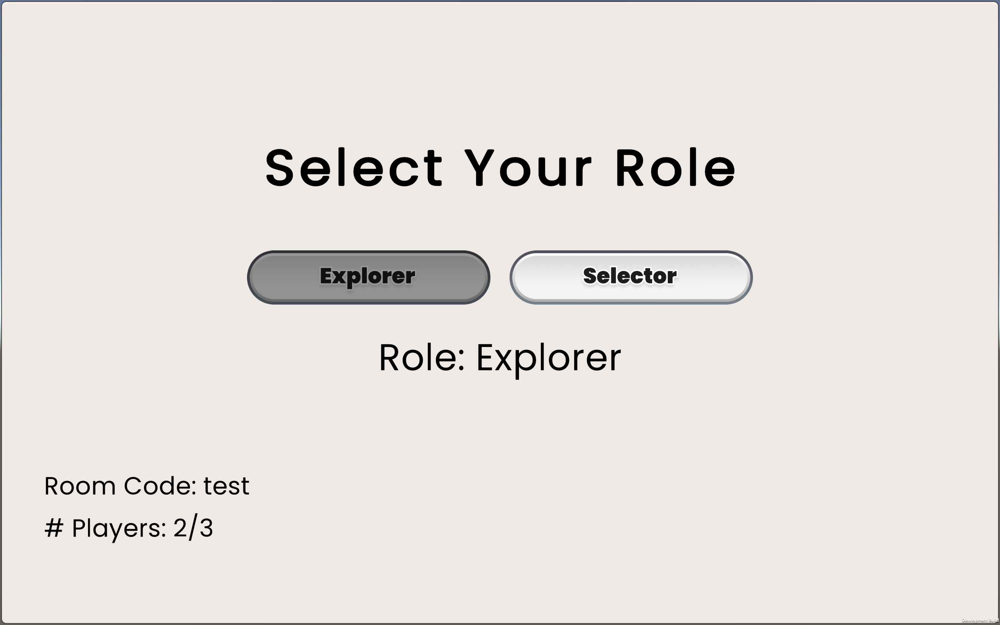
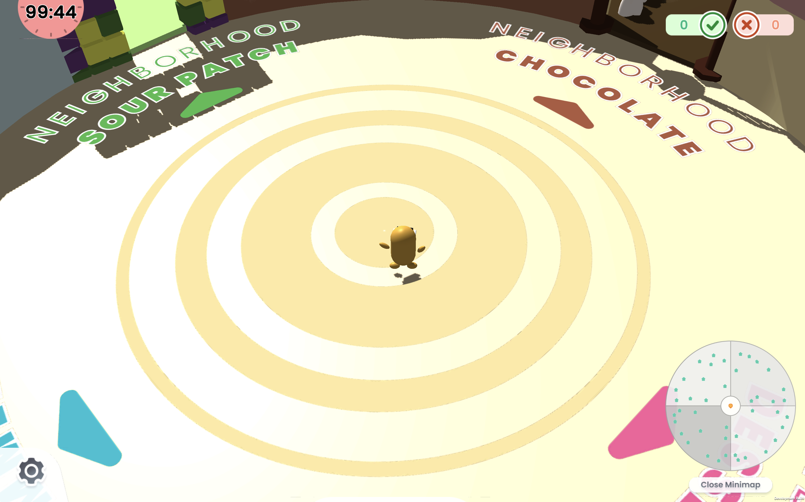
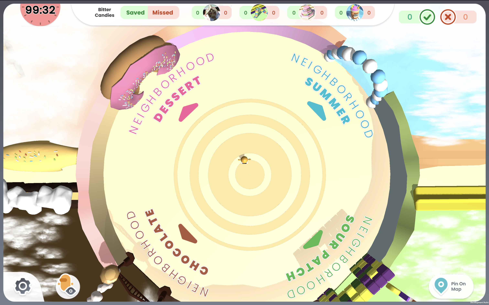

# BitterBuster Implementation
## Overview
This document provides implementation details on BitterBuster. For further Unity documentation see their [User Manual](https://docs.unity3d.com/Manual/UnityManual.html).

## Code Structure
BitterBuster follows the standard folder structure of Unity Projects. Most edits to the game will take place in the `Assets` folder, which contains:

```
Assets
| - Animations        # All animations + animation controllers
| - Art               # All art assets
| - Materials         # All object materials
| - Photon            # Photon Package
| - Plugins           # Other Unity Plugins
| - Prefabs           # All prefabs
| - Presets           # Editor presets
| - Rendering         # Rendering-related assets
| - Resources         # Special Resources folder
| - Scenes            # All game scenes
| - Scripts           # All C# scripts
| - Sounds            # All SFX + BGM sound assets
| - TextMesh Pro      # Text rendering package
| - Textures          # All textures
```

Most of these folders contain various assets that are used within the game, such as 3D models, 2D art, and sound. The below sections will highlight some of the key folders to be familiar with.

### Scenes
Each "level" within Unity is captured within a **Scene**. For BitterBuster, there are three main scenes:

- **StartScreen:** The first scene when a user opens the game, provides options to host, join, or quit the game.
- **PreGame:** The setup scene after a player joins or creates a room. This is where hosts update the settings of the game and players can select their role of Selector or Explorer.
- **Game:** The main game scene. This contains the entire Candy Kingdom world along with all of the components of the gameplay.

To edit a particular **Scene**, double-click its corresponding file in this folder. 

### Resources
The [Resources folder](https://docs.unity3d.com/Manual/BestPracticeUnderstandingPerformanceInUnity6.html) is a special folder in Unity that allows for runtime loading of assets. It contains prefabs used by Photon to create multiplayer instances of during runtime (such as the player objects), along with default Bitter/Sweet candies that are loaded at runtime as well.

### Scripts
All of the code within the game is located in this folder. Each of the code files is also separated into more specific directories based on functionality:

```
Scripts
  | - Controllers        # GameObject controller scripts
  | - Logging            # Logging-related scripts
  |  | - LogEvents       # Defined log events
  | - SceneManagers      # Scene manager scripts
  | - Sound              # Sound-related scripts
  | - UI                 # UI-related scripts
  |  | - Components      # Subset of scripts for specific UI components
  | - Util               # General utility scripts
```

#### Controllers
Each of the scripts in this directory relate to a key GameObject used in the main game - for instance, controllers for the Explorer, for traps, for houses, etc. Each instance of this object will contain the corresponding controller script as a component, which will contain common functionalities and parameters for the object.

#### Logging
All logging-related logic is contained in this folder. This consists of the overall `Logger` that is used by the host along with all of the different events that the `Logger` will log.

#### SceneManagers
Each scene in BitterBuster has a corresponding manager class, which handles the overall logic of that given scene.

The `GameManager` class is the most important script in this folder as it contains all of the overarching logic for the main game. This includes handling game events by broadcasting them to all machines.

An additional class defined in this directory is the `EventManager` class, which is used in the main game to broadcast and add/remove listeners to all gameplay events.

#### Sound
This directory contains managers and related scripts for SFX and BGM used in the game.

#### UI
This directory contains managers and related scripts for all of the UI used in the game.

#### Util
This directory contains utility scripts used in the game. Some key ones to note are:
- **Candy.cs:** Contains definitions for Candy fields and other related classes, such as a `CandyLoader`.
- **FileSelector.cs:** Contains wrapper functions for a file selector plugin that allows for runtime usage of a local file selector. This is currently used to upload JSON files, candies, etc.
- **RoomCustomProperties.cs:** Allows for access and storage of room-based properties, such as the global game settings and Explorer/Selector ID. This is used to persist values between the   `PreGame` and the `Game` scenes.

## Multiplayer Structure
For more details, Photon provides a [documentation wiki](https://doc.photonengine.com/en-us/pun/current/getting-started/feature-overview) describing how their many functionalities work.

To [start a multiplayer session](https://doc.photonengine.com/en-us/pun/current/lobby-and-matchmaking/matchmaking-and-lobby), one machine must first create a **room** with a room code. The creater of the room is considered the `MasterClient`. This room code can then be used by other machines to join the same room. If the `MasterClient` disconnects, one of the other players will then become the `MasterClient`; if there are no other players in the room, it is shut down.

When using Photon with Unity, all GameObjects are instantiated locally, and all function calls will only affect the local objects. In order to make cross-machine calls, we use [Remote Procedure Calls (RPCs)](https://doc.photonengine.com/en-us/pun/current/gameplay/rpcsandraiseevent). This will be what we make use of throughout the game to synchronize core game events between the different machines.

## General Game Flow
The following sections provide a general overview of what happens behind-the-scenes in a given play session.

### Start Scene
On the start screen, a player can select whether they would like to host or join the game. In clicking the button, the game will prompt them for a game code, then create or join the room respectively depending on which option they pick.



Here, a host status is determined by setting the `playerType` field of the `Player` class to be `Host`. This value persists onto future scenes. From Photon's perspective, this host is also the `MasterClient`.

### PreGame Scene
Once a host has created a game, they are led to the pre-game screen:



Here, they can also access the settings for the game:



The host can then use this screen to upload any gameplay settings through the JSON configuration file. This value is stored using Photon's support for room-based custom properties, of which the main functions are wrapped in the `RoomCustomProperties` class.

From a player perspective who has joined the room, they can select their role on the pre-game screen:



This updates the `playerType` in the `Player` class to whichever they select, along with storing the user ID within the `RoomCustomProperties` class. Both values will persist into the main game scene; the former will be used for most of the gameplay, and the latter is used to ensure exclusivity of role selection (i.e. making sure we don't let both players choose the same role) and to handle player disconnects.

Once two players have joined and selected their roles, the host can click a button to start the game.

### Main Game
#### Initialization
Upon entering the game, there are a number of items that are immediately processed behind the scenes.

Firstly, in using the `playerType` field, many objects will initialize/destory themselves based on what the local player's role is. For instance, the Selector will only see the Selector UI; houses will only initialize their own mailbox colors on the Explorer side; only the Host will be able to toggle between the two cameras; and so on.

The Host also will do some additional setup, such as loading the Candies. Because Candy images are only configurable on the Host side, only the Host will upload and store the images, and most future communication about Candies will be through passing their corresponding ID numbers around; only when the Candy really needs to be displayed (i.e. for the Selector's selection process) will the actual image bytes be passed along.

The two players are presented with their respective onboarding screens (which will differ depending on the player's roles), and then can start the game together.




#### Main Loop

Afterwards, the two players enter the main gameplay loop. Some aspects, such as the Explorer's position and rotation, are values that are automatically synced by Photon. Otherwise, the general gameplay loop will result in the following:

- Player performs an action (visits a house, clicks a button), which causes some local changes
- Action communicates with the GameManager through making a call `GameManager.Instance.Broadcast...(...)`
- The `GameManager` function will call a corresponding RPC function on each machine
- The RPC function will locally broadcast the `GameEvent`
- Any listeners to the broadcasted event will respond accordingly

This continues until time runs out and a game over state is triggered in the `GameManager`.
