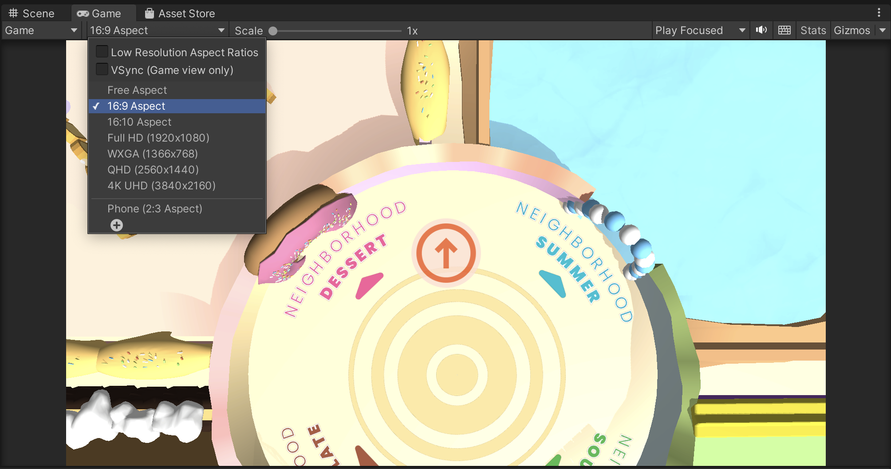

# BitterBuster Installation
## Overview
This document provides the details on how to install and set up a development environment for BitterBuster.

## Setup
### Repository Link
[https://github.com/ETCF22-HAI/BitterBuster](https://github.com/ETCF22-HAI/BitterBuster)

### Tech Requirements
#### Unity
The majority of the BitterBuster code is developed in C# within the [Unity](https://unity.com/download) game engine version 2021.3.9f1.

Unity provides download instructions for Unity Hub and the Editor itself; the specific version used for this project can be found [here](https://unity.com/releases/editor/archive).

It is recommended to modify Unity files using the [Visual Studio](https://visualstudio.microsoft.com/downloads/) IDE. 

#### PUN
Multiplayer is implemented using [Photon PUN](https://www.photonengine.com/en-US/Photon). Currently, this project is being developed using the [free tier](https://www.photonengine.com/en-US/PUN/Pricing) offered by Photon, which allows for 20 CCU. Should the project be expanded in the future, higher tiers may need to be purchased to account for a larger user base.

Photon provides extensive [documentation](https://doc.photonengine.com/en-us/pun/current/getting-started/pun-intro/) on its many features. The package needed to integrate PUN with Unity has already been installed but is currently being used with a development PUN ID belonging to the HAI team; a new ID and account should be made to set up the game for the research team. You can follow the setup tutorial provided [here](https://doc.photonengine.com/en-us/pun/current/demos-and-tutorials/pun-basics-tutorial/intro).

#### ParrelSync
To test multiplayer development within the Unity editor, we use the [ParrelSync](https://github.com/VeriorPies/ParrelSync) plugin. This has already been installed via the package manager.

### Installation Steps
1. Download and install [Unity Hub](https://unity.com/download) and [Unity Editor version 2021.3.9f1](https://unity.com/releases/editor/archive). When downloading the Editor, ensure that you add modules for all the platforms you wish to build for (usually, this includes WebGL, Windows, Linux, and Mac)
2. Clone the [BitterBuster repository](https://github.com/ETCF22-HAI/BitterBuster) locally
3. Open Unity Hub -> Projects -> Open -> Select the BitterBuster project folder

### Development Setup
#### Multiplayer Setup
To help support local multiplayer development, this project makes use of the ParrelSync plugin to create auto-syncing clones of the editor. 

> **Note:** Testing three editor instances of the game on a single computer can be very CPU-intensive and definitely not recommended for laptops or weaker desktops; another alternative is using builds to join the game and fill in for the other roles.

1. In the tabs at the top of the window, select ParrelSync -> Clones Manager
2. Click on the "Add new clone" button twice to create two clones
3. To open the cloned instances, click on the "Open in New Editor" buttons

While testing in the Unity Editor, you can click the "Run" play button on each editor and create/join rooms on each editor instance

#### Util Functions
In Unity, clicking on the "Run" button will start running the game from the currently open scene. However, as most development happens in the "Game" scene, it becomes bothersome to manually swap scenes before running.

As a shortcut, you can click on `Util -> Set Starting Scene` to automatically set the default starting scene to the "StartScreen" scene. This will need to be clicked once every time the editor is first opened.

#### Play Mode
To run a Unity game in the Editor, click on the Play button at the top of the window. This will automatically direct you to the game mode screen.

All of the UI was built for a 16:9 aspect ratio. You can use the dropdown at the top of the game screen to adjust the screen ratio.

